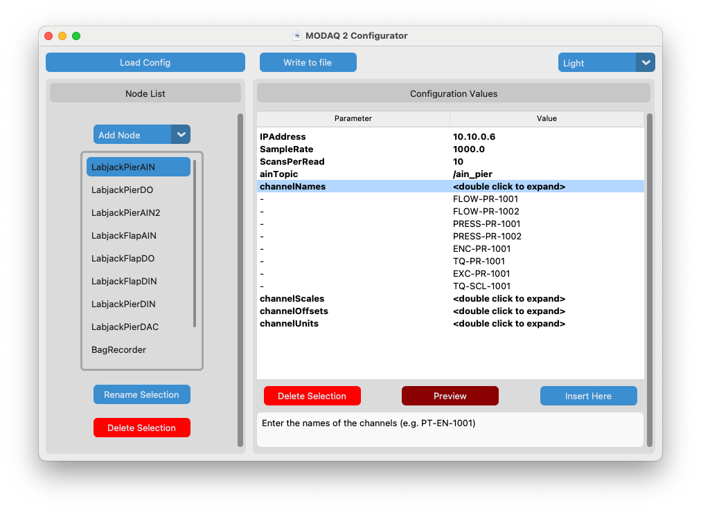

# M2 Configurator 

Configurator MODAQ2 Repo: <a href="https://github.com/MODAQ2/configurator" target="_blank">MODAQ2/configurator</a>

Several parameters within M2 can be configured through the use of a yaml file that is located in <a href="https://github.com/MODAQ2/m2_core/blob/main/m2_launch/config/m2_config.yaml" target="_blank">`/src/m2_core/m2_launch/config`</a>. This allows the M2 source code to be somewhat stateless, while allowing common or project-specific changes to be applied at runtime. 

While the yaml file is plain text and can be edited in any basic text editor, this is not recommended since invalid inputs or formatting errors could result in unintended settings or render the file unusable. The Configurator exposes all available configurable items for the selected M2 nodes and performs validation on user inputs.

## Features
- Edit an existing configuration or create a new one from scratch
- Auto archiving of loaded config files
- Message box at bottom of window to display context-aware help or error info
- Input validation to assure values typed by user are acceptable
- Light/dark mode

<!---

-->
<figure>
    
    <figcaption>Figure 1. M2 Configurator screencap. Mouse over to reveal legend.</figcaption>
</figure>

if you mouse over the image above, reference numbers appear next to the GUI elements that correspond to the following list of explanations:

1. Load Config button: This will open a file browser window for loading an existing configuration. A copy of the loaded file will automatically get created as a backup. This is unnecessary when creating a new configuration.
2. Write to File button: When done editing a configuration, select this button to save the configuration to a yaml file.
3. Switch between light and dark modes.
4. Node selection pane. A node is an M2 software module containing configurable items that is launched as part of functional M2 system. (see: [ROS2 Nodes](techref.md#ros2-nodes))
5. Selection dropdown for available nodes that can be added to the configuration.
6. Window showing nodes that have been added to the configuration. If an existing  configuration was loaded, the nodes in that file will populate here. On a new configuration, this window will be empty until nodes are added from the dropdown box (5).
7. Rename the selected node. Please see section XXX for node naming guidance.
8. Delete the selected node. Use with caution: there is no undo for this.
9. Configuration pane
10. Window for viewing and editing configuration values.
11. Double clicking on a value will enable editing of that value. Some items, such as Channel Names may have more than one value. In these instance, double clicking on the text will expand (or unhide) the values.
12. Example of the expanded view for parameters with multiple values. These can be edited or deleted individually. New values can be inserted (up to limits specified in the schema).
13. Delete Selection button: this will delete the highlighted parameter and value. There is no undo.
14. Insert Here button: On Parameters with multiple values, a new value can be inserted at the highlighted location. NOTE: new parameters cannot be added, only new values for existing multi-value parameters. 
15. Message Box: Helpful test will appear here as the user clicks on elements in the Configuration pane. 

## Getting Started

The M2 Configurator is written in Python and uses a couple of popular libraries. Our original intent was to offer standalone executable versions of this code so that it would not be necessary for end users to have or install python on their systems. However, executables may be blocked by policy on managed computer systems or flagged as potential malware due to the lack of a signed certificate. Since, it's assumed the likely users of the M2 Reference Design and this configurator have some level of skill with programming, we're distributing just the source code and the following setup guide. Users can compile executables if so desired using utilities such as <a href="https://pyinstaller.org/en/stable/index.html" target="_blank">Pyinstaller</a>. 

### Recommended Setup
While not absolutely necessary, we do recommended creating a Python virtual environment to edit and run the Configurator. The virtual environment or venv encapsulates python and the required libraries in a separate 'workspace' and has certain <a href="https://www.geeksforgeeks.org/python/python-virtual-environment/" target="_blank">benefits</a>. If you prefer not to use a venv, skip steps 2 and 3 below.

1. In a terminal, navigate to or create a folder for your M2 Configurator workspace.
2. Create a new venv for the M2 Configurator workspace: 
`python3 -m venv modaq_venv` (replace modaq_venv with your preferred name)
3. Activate the workspace: 
MacOS/Linux: `source modaq_venv/bin/activate` or `source ./modaq_venv/bin/activate` 
Windows (cmd): `modaq_venv\Scripts\activate` or `modaq_venv\Scripts\activate.bat` 
Windows (PowerShell): `modaq_venv\Scripts\Activate.ps1`
4. Install required libraries. 
    - `pip install -r requirements.txt` 
    or if you prefer not to use our requirements.txt file
    - `pip install PyYAML customtkinter CTKMessagebox CTKListbox` 
    - `pip freeze > requirements.txt` (optional) 
5. Place the M2 Configurator python script (m2conf.py) and schema (m2_config_schema.yaml) in the workspace folder.
6. Done!

## How to Use
Assure that the venv has been activated (if using a virtual environment) then launch the Configurator: e.g. `python m2conf.py`  

!!! Note 
    The numbers shown in parentheses below correspond to the numbers revealed when mousing over Figure 1.

An existing M2 yaml configuration file can be loaded for editing or a new one created from scratch. Much of the Configurator operation is the same either way. 

#### Load an Existing Configuration File
Select **Load Config** button (1) and select an existing yaml file from file dialog box that pops up. The M2 nodes available in that configuration file will be populated to the node selection listbox (6).

#### Starting from Scratch
Select the **Add Node** dropdown box (5) and select a node to add to the configuration in the node selection listbox (6). Repeat this process until all nodes are added to listbox. 

!!! Warning
    
    Do not add two or more of the same node type without first renaming the node after it it added. For instance, if you want add two LabJackAIN nodes, add one to the listbox, then highlight it and rename it. Then add the second. Failure to do this will cause unpredictable results- but usually you'll just have 2 entries in the Node List for the same node (they won't be unique- even if renamed later). 

#### Viewing and Editing the Configuration
Selecting any node that appears in the listbox (6) so that it is highlighted will result in its associated Parameters and Values (key/value pairs) being displayed in the Configuration Values (10) window. 

Parameters can be highlighted by mouse selection and help or info text for that parameter will appear in the Message Box (15). A highlighted parameter and its value(s) can be deleted with the **Delete Selection** button. However there is no **undo** for this and inserting new parameters is currently not possible within the Configurator. 

The Values side of the Configuration Values window is editable. Double clicking on any value will allow the cell to be modified. Pay attention to the help text in the Message Box (15) for the type and/or format of input expected (e.g. integer, float, string, IP address, etc.). The configurator does perform some input validation (watch the Message Box for feedback), however some improper inputs may be accepted- particularly string type inputs. 

Some Parameters/Keys expect allow for more than one value. These values are displayed collapsed with `<double click to expand>` to show the list. Editing, deleting, and inserting are allowed in these lists. Some parameters have limits on the number of values that can be added to a list. For instance an 8 channel analog input node cannot have more than 8 channel names configured. The Configurator will warn the user if they attempt to add more values than the parameter supports in the Message Box.

??? Info "Q&A"
    **Q: Why can't I add a new parameter to a node?**  
    A: The C++ code for a node must be specifically written to accept configurable values at launch. All such configurable values for a node are already presented when a node is added to the configuration.

    **Q: What happen with M2 if I deleted a parameter, will it still work?** 
    A: Depending on which parameter was deleted there may be no noticeable impact to the operation of M2. This is because all configurable parameters are hard-coded with default values that are used if values are not passed in at launch. However, those default values may cause undesirable behavior if a parameter is missing such as with email addresses or file paths.

    **Q: How do I get a parameter back if I accidentally delete it?** 
    A: At this time, there is no direct way to insert a parameter- maybe in a future release. However as a workaround, delete the entire node from the node listbox and add the node back again. Any previous edits on the deleted node will be lost, but the deleted parameter will now be available. 

    **Q: I renamed a node and it does not work when I launch the M2 code** 
    A: Node names in the configurator must match their launch names in the M2 code see: [Link](software.md/#example-launch-and-config-files).  

#### Saving a Configuration
The edited configuration can be saved to a file by selecting the **Write to File** button. A file dialog will appear with either the loaded filename prepopulated (in the case of a loaded config) or a default name (in the case of a new configuration). The user can override this and name the file something else- however this filename must match the config filename specified in the M2 launch file (see: [Link](software.md/#example-launch-and-config-files)). 

## Technical Details
The M2 Configurator is written entirely in Python 3.12 (specifically: 3.12.7) and is using <a href="https://docs.python.org/3/library/tkinter.html" target="_blank">Tkinter</a> from the standard library for creating the GUI with added visual flare from <a href="https://customtkinter.tomschimansky.com/" target="_blank">CustomTkinter</a> (along with the widgets <a href="https://github.com/Akascape/CTkListbox" target="_blank">CTKListbox</a> and <a href="https://github.com/Akascape/CTkMessagebox" target="_blank">CTKMessagebox</a>).

#### The Schema
On launch, the code loads the file `m2_config_schema.yaml` into a dictionary object `schema_in` and this dictionary is referenced during runtime for a number of purposes. This allows the general Configurator code to be mostly stateless and as new nodes or configurable parameters are added to M2, only the schema needs to be updated to enable these new features.  

The schema contains runtime settings for all currently released M2 nodes, as well as associated key/value pairs that the Configurator uses to validate user input and display help information. These special configurator-only keys contain a suffix with an underscore `_` followed by a token, such as `_dt` (for datatype). The following are examples of schema-specific subkeys and how they are used in the Configurator:

`channelScales_dt: float` - The expected datatype of the user input 
`channelScales_max: 8`  - Maximum number of entries allow for this key 
`channelScales_help: "Enter the scaling value for the channel as a floating point number"` - Text to display in the message box 

In cases where the user renames a node, the Configurator will insert a key `schema_template` into the working dictionary that references back to the original key name in the schema so that input validation and help text continue to work. 

#### Working Dictionary
A second dictionary is created by the configurator which is used to store a 'working' copy of the configuration the user is building and editing. If an existing yaml file is loaded into the Configurator, the entire contents of that file are written to the working dictionary. In cases where the user starts from scratch or adds new nodes from the Nodes List dropdown menu, the selected nodes are written to the working dictionary. The contents of the working dictionary are used to populate the nodes that appear in the Nodes List listbox and the key/value pairs that appear in the Configuration Values table.

When the user selects `Write to file`, the contents of the working dictionary are converted to yaml and written to the output file. The working dictionary can be viewed at any time in the terminal window by clicking the `Preview` button. 

!!! Note
    The `Preview` button was used for debugging during the development process but was considered to retain value for general users of this code. It should be disabled if the code is compiled into a executable, since a terminal window will be unavailable. A future version of this code may print the preview to a spawned text window instead of the terminal.

#### The Classes
The code is organized as a collection of classes that encapsulate the various GUI and logic elements. In total there are four classes that do the following:

`App` Top-level class that defines the overall GUI window parameters, including the grid layout of the GUI elements. It also includes the methods for loading and saving the yaml files. 
`NodesFrame` Defines the look and functionality of the Nodes List pane on the left side of the GUI window. It contains methods for managing the included listbox contents. 
`ValuesFrame` Defines the look and functionality of the Configuration Values pane and message box on the right side of the GUI window. It contains methods for displaying and manipulating parameter values and updating content the message box. 
`EntryPopup` This class contains the logic to enable the (apparent) in-place editing of the values in the Value column of the Configuration Values pane. The Configuration Values pane uses the Treeview widget from Tkinter to create the table view. Unfortunately, Treeview does not contain a native method for directly editing table values by a user in the GUI. EntryPopup gives the illusion of directly editing the table values by creating a small popup modal sized and placed over the field the user double-clicked to edit. After the user enters their desired value and hits enter/return, that value is updated to the table underneath the popup and the popup is then destroyed. From the user's perspective, it appears they directly edited the table. 

#### Assuring Compatibility with the M2 Code
Some of the actions allowed by the Configurator can break compatibility with the M2 software. For example, while renaming nodes is allowed, the new name must match the node name assigned to the node in the M2 launch file (`m2_launch.py`) settings- otherwise the renamed node will be ignored when M2 launches. A node can be given any name in the launch file as long as it meets syntax requirements and is unique. Therefore, when it comes to renaming nodes, it may be necessary to also change the name (manually) in the launch file too. 

Similarly, the file name given to the configuration file must agree with the filename specified in the launch file. 

The C++ language that M2 is written in is a strictly-typed language and in such, if a node expects an integer datatype for a configurable value, yet a float datatype is provided from the configuration file, that node will issue an error and fail to launch. For this reason, the Configurator schema includes the expected datatype for each parameter and validates user input to reduce the likelihood of this type of error occurring. In some cases, the Configurator will attempt to coerce the input to the correct datatype, but sometimes this is not possible (see [Known Issues](configurator.md/#known-issues)). An input of `20` is an integer, while `20.` (with a decimal point) is a float. 

## Known Issues
There are some known issues present in this release of the M2 Configurator. These are expected to be addressed at a later time, but are considered either 'Quality of Life' or edge-case issues- so not critical.

- Values window (Treeview) does not properly respond to dark mode
- If a user inputs a float where an int is expected, operation will not complete and displays an error in the message box. Expected behavior is to coerce float to an int- however this 'bug' might be considered a feature since it requires the user to fix the erroneous input.
- If user renames a node to a name that already exists in the listbox, weirdness ensues. Need to add a check to the validation method to prohibit duplicate names.
- Similarly, if a user adds two (or more) nodes of the same node to the listbox from the dropdown menu, they will not be unique- rather they point to the same object. Workaround is to add the first node and rename it, then add the second node. This is more commonly a problem with larger M2 designs that have multiple input modules of the same type, such as 2 LabJacks performing analog input operations.
- If an existing config is loaded that contains nodes named differently than the names used in the schema and does not contain a valid schema_template key, any edits in the Configuration Values window (ValuesFrame) will throw an error.
- It's possible on some systems that the executable version of the configurator may be disallowed either due to policy (managed computer and user does not have sufficient permissions) or malware detection (the app is distributed without a signed certificate). For these reasons, a standalone executable of the configurator app will not be offered on this repo. 

## Acknowledgements
The in-place editing technique used in this app, which allow for double-clicking on an item to change its value in the Configuration pane is based on a tutorial published on <a href="https://coderslegacy.com/how-to-make-ttk-treeview-editable-python" target="_blank">CodersLegacy.com</a>. 